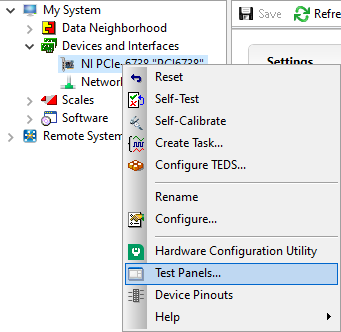

.. _assembly-home:

###############################
Physical Assembly
###############################

Baseplate Assembly Process
______________________________

Our baseplate design was made with ease of assembly in mind. The basic process involves aligning Polaris posts with
dowel pins and screwing them using 1/4"-20 Screws in at the predetermined hole locations on the breadboard.
This general process is depicted below:

.. figure:: Images/BaseplateAssembly.png
    :align: center
    :alt: General process for baseplate assembly

    **Figure 1:** General process for baseplate assembly

To either mount the baseplate onto an optical table or onto separate posts, the process is similar in that
just requires screwing 1/4"-20 screws into either an optical breadboard or onto separate posts at the four corner holes.

.. image:: Images/BaseplateAssembly_Corners.png
    :align: center
    :alt: General process to place posts on baseplate corners

Mounting Lenses
______________________________

Mounting lenses into a Polaris lens mount and onto an associated post is a fairly straightforward process. The
general flow is shown in the image below, where first the flatter face of the desired lens should be placed such that
it is touching the metal boundary on the lens mount itself. Then the lens should be fixed into place by screwing the
lock screw on the top of the lens mount. With the lens secured in the mount, then two dowel pins should be placed in
the appropriate holes on the Polaris post, and then the lens mount should be placed such that the two holes on the
lens mount align with the pins on the Polaris post. Then the lens mount should be anchored into place by screwing it
into the Polaris post.

.. image:: Images/LensMounting.png
    :align: center
    :alt: General process for mounting a lens into a Polaris holder and onto a post

###############################
Illumination Path Assembly
###############################

1. Initial Laser Collimation and Alignment
__________________________________________

When first assembling the system, ensuring proper output collimation from the fiber laser source is critical. There
are multiple checks that one can take for this step, but we utilize a combination of a shear-plate interferometer
(https://www.thorlabs.com/newgrouppage9.cfm?objectgroup_id=2970) and two pinhole apertures placed at opposite ends
along the length of the baseplate. Shear-plate interferometers are designed to split and interfere an input beam of
coherent light, such that when the beam is collimated there are interference fringes aligned vertically with a
reference line. The fiber laser collimator we used for this system is the Thorlabs CFC11A-A (https://www.thorlabs.com/thorproduct.cfm?partnumber=CFC11A-A), which features an adjustable barrel which controls the position of collimation optics within the element.

The basic assembly process involves first inserting and fixing the CFC11A-A into a Thorlabs AD15S2 adapter, which
allows it to then be mounted into a 2.5" Polaris K1XY mount. This assembly is then mounted onto the respective Polaris
post at the start of the baseplate. The fiber laser source is then able to be directly mounted into the CFC11A-A, making sure that the protrusion on the fiber wire aligns with the open section of the CFC11A-A port. The basic process of ensuring collimation then involves turning on the laser source, and placing the shear-plate interferometer such that the input port aligns with the output of the laser unit. Then, by slowly adjusting the barrel of the CFC11A-A and observing the interference fringe orientations along the top display of the interferometer, one is able to adjust the beam until it is properly collimated.

With the beam collimated, the process of beam alignment involves adjusting the position control knobs on the K1XY to
have the beam pass through two pinhole apertures along the optical path. The height of the initial laser output is designed to be at 3.75" above the top surface of the baseplate, so selecting appropriate post heights for the apertures such that their centers rest at 3.75" is essential. In our case, we use Thorlabs ID12 pinhole apertures (https://www.thorlabs.com/thorproduct.cfm?partnumber=ID12), so using a post height of 3.25" will ensure that they are at the proper height for alignment. We designed a `custom ID12 to Polaris adapter <https://github
.com/TheDeanLab/COMPASS/tree/main/downloads/common/cad>`_ to ensure the aperture is at the proper height and properly
aligned along the designated Polaris axis. When using this method, the ID12 to Polaris Adapters can just be directly mounted onto the holes designated for L1 and the Illumination Objective, depicted below, to cover the length of the baseplate. With the pinholes placed, the process becomes iterative by making small adjustments on the K1XY tip/tilt knobs and XY position screws until the beam passes through both pinholes.

.. image:: Images/LaserAlignment2.png
    :align: center
    :alt: Performing beam alignment across the baseplate

2. Mounting of Optic Posts
______________________________

After ensuring basic collimation and alignment of the laser system, the next step is mounting the appropriate polaris
post size for each optical element in the system. The overall breakdown of which size posts went with each hole
location is listed below. Where holes (3),(4), and (10) are placements for optional elements in the system. (3) is
meant for the placement of an adjustable pinhole aperture, where the same ID12 to Polaris Adapter system used in
the alignment step can be placed. Otherwise a 0.5" post holder can be placed here, and then the ID12 or ones pinhole
aperture of choice can be mounted on a 0.5" post. (4) is dedicated placement for an electronic shutter in the event
that the laser being used for the system isn't directly controlled via a computer, and helps to ensure that laser
light is not photobleaching a sample unless imaging is taking place. (10) is dedicated space for a neutral density
(ND) filter, in the event that the power of the laser used needs additional reduction not directly addressable
through the laser controls itself.

.. image:: Images/PostHeightBreakdown_Updated.png
    :align: center
    :alt: Schematic of which holes use which post heights

3. Mounting of Optics
______________________________

With the posts in place, the next step involves mounting the optics elements themselves onto the posts. When mounting
elements (6), the VA100 rectangular aperture, and (7), the RSP1 rotation mount, it should be noted that the
corresponding element should first be fixed onto their respective Polaris adapter and then onto the Polaris posts. In
addition, take measures to mount the 45 degree mirror (9) fully prior to mounting the resonant galvo to ensure that
the galvo is not accidentally hit during installation of the 45 degree mirror.

To construct the 45 degree mirror assembly, first mount the Polaris K1S4 onto the Polaris-MA45 45 degree mounting
adapter, and then place a 1" diameter mirror into the K1S4 and secure it using the K1S4 mounting screw.

To construct the illumination objective assembly, first mount the Polaris 1XY onto its respective 1.5" post. The
threading of the 1XY (SM1) does not match that of our illumination objective used (M25x0.75), so an SM1A12 adapter
must first be installed onto either the 1XY or the illumination objective. Then, the objective can be mounted onto
the 1XY.

4. Final Alignment Adjustments
______________________________

Once all the optics have been properly mounted, the final step for ensuring a working illumination path is to center
the beam after the 45 degree mirror onto the center of back lens surface of the illumination objective. The primary
method of doing this is through adjusting the xy tip/tilt knobs on the K1S4 Polaris mount that houses the 45 degree
mirror.

###############################
Hardware
###############################

Differences in Simulated and Physical Coordinate Definitions
____________________________________________________________

It should be noted briefly that when discussing our physical microscope systems using navigate software, the definitions
for the coordinate axes is different than that of our simulations. This is due to a difference in standardized
definitions for the axes in our previous systems and how Zemax defines these same axes. This difference is depicted in
the picture below:

.. image:: Images/CoordinateSchemeChange.png
    :align: center
    :alt: Difference in coordinate axes for simulation and physical setup

Visualization of Axes Mapping
______________________________

In our system we essentially have 5 different translation stages at work: the standard x,y, and z axes, an additional
stage along the z axis to control the focus of the detection path (f), and and axis associated with the piezo positioned
such that its normal is 60.5 degrees away from the y-axis.

.. image:: Images/PhysicalAxesMaps.png
    :align: center
    :alt: Layout of how the axis of the system are mapped

The Piezo Angle Mount
______________________________

We designed a custom angled mount for our `Piezoconcept HS1 piezo <https://piezoconcept-store.squarespace
.com/1-axis/p/hs1>`_ in order to be able to scan our sample easily between our two
objectives by translating a single motorized unit (in this case the piezo), instead of having to calculate and
program the movement of two translation stages in tandem for both the y and z directions. The anatomy of our angled
mount is broken down in the figure below, where there are four translation stage mounting holes to attach the unit to
an ASI translation stage, nine Piezo mounting holes that correspond to the mounting scheme of
our piezo unit, as well as four through-holes and a window for ease of access for the mounting process. We provide
the CAD files for this mount `here <https://github
.com/TheDeanLab/COMPASS/tree/main/downloads/common/cad>`_, and have had success in using both 3D printed and
aluminum machined versions of the unit. It's recommended to first mount the angle mount onto the translation stage
unit before mounting the piezo on the angle mount to ensure access to all the through-holes.

.. image:: Images/AnglemountAnatomy.png
    :align: center
    :alt: Breakdown of our custom angle piezo angle mount

The installation of our custom angled piezo mount is designed to be directly compatible with ASI translation stages.
ASI translation stages feature M6 hole pairs that are spaced along the length of the translation stage at intervals
dependent on the specific stage one is using. The mounting process involves aligning these 4 holes with 4 of the M6
holes on the translation stage and screwing them in. For ease of screwing in the base, there are four through holes on
the angled face of the mount shown in B that a screwdriver is able to pass directly through to screw as shown in C. An
alternative method of mounting is shown in D, where the window on the back of the angle mount is able to be screwed
through as well.

.. image:: Images/Anglemount.png
    :align: center
    :alt: General process for mounting our piezo angle mount onto an ASI translation stage

Sample Holder Design
______________________________

Our sample holder design is built for using fixed cells on a 5 mm coverslip, and is shown below. The design features a
clamp-like method of securing the 5 mm coverslip in place, where the coverslip rests in an inset region and the clamp
is screwed in via an M1.6 screw in the back of the holder. All associated files for this design and
other custom parts can be found `here <https://github
.com/TheDeanLab/COMPASS/tree/main/downloads/common/cad>`_.

.. image:: Images/S_SampleHolderAssembly.png
    :align: center
    :alt: 5 mm coverslip sample holder design

Assembling the Magnetic Sample Mount
____________________________________

As a safeguard for the risk of the sample crashing into either the illumination or detection objective during sample
positioning or imaging, we opted to incorporate a magnetic mount for our sample holder. We use a Thorlabs KBT1X1T and
KBB1X1 as our magnetic mount pair, and then mount our sample holder onto the KBT1X1T using a  `custom adapter <https://github
.com/TheDeanLab/COMPASS/tree/main/downloads/common/cad>`_. The KBB1X1 is affixed to the piezo using an M2.5 screw, and using a small leveling tool (shown below)
during this step is helpful to ensure that the magnetic base is mounted as level as possible for the imaging process.

Wiring Diagram
______________________________

Our complete microscope assembly features a variety of different optoelectrical and optomechanical elements. These
elements are primary controlled via our NI DAQ (PXIe-6738) or our ASI Tiger Controller (TG16-BASIC), which are then
controlled via navigate during the imaging process. The diagram below depicts how these elements are wired together,
as well as an individual pinout designation table for the pin configurations we used on our DAQ.

.. image:: Images/Wiring3_Plustable.png
    :align: center
    :alt: Basic assembly of magnetic sample holder mount

Piezo Setup & Troubleshooting
______________________________

On the PCI Board, connect the positive and negative wires  to the corresponding analog output (AO) you want, in our case
we used AO 0, so we connected the positive wire to pin 10 and the ground to pin 11, then plug the BNC cable connected to
those wires into the EXT IN input on the Tiger controller panel corresponding to the piezo.

.. image:: Images/DevicePinouts.png
    :align: center
    :alt: How to find the Device Pinout panel

Plug the piezo cable into the PIEZO input on the Tiger controller panel corresponding to the piezo.

Verify the range of the piezo in the tiger controller software with the command "5 cca x?"

    At first, ours output the following:
        | :A  Q:P1
        | 23 P 1 100um RANGE
        | 24 P 2 200um RANGE
        | 35 P S 150um RANGE
        | 36 P 3 300um RANGE
        | 37 P 5 500um RANGE
        | 34 P f 50um RANGE
        | 25 P 4 350um RANGE:N-4

This tells us that our Piezo (Panel 5/Q) corresponded to P1 or a 100 um range, but ASI requires the piezo needed to be
set to  a 50 um range to be able to be intitialized instead. To change this, we used the command "5 cca x = 34" and
power cycled the controller.

    Then our output became:
       | :A  Q:Pf
       | 23 P 1 100um RANGE
       | 24 P 2 200um RANGE
       | 35 P S 150um RANGE
       | 36 P 3 300um RANGE
       | 37 P 5 500um RANGE
       | 34 P f 50um RANGE
       | 25 P 4 350um RANGE:N-4

Now we can see that the piezo is set to the correct range (Pf).
With that verified, now confirm that the voltage output from the PCI Board is working:

| 1. Put the BNC cable input currently in EXT IN on the Tiger control panel into the input of the oscilloscope instead.
| 2. Go to the test panels for the PCI board in NI MAX.

| 3. Set the voltage mode to sinewave generation.
| 4. Set the voltage range to be between 0 to 10 V.
| 5. Set the frequency to a desired value (we ended up setting it pretty high at 10000 Hz for ease of viewing on the oscilloscope).
.. image:: Images/TestPanelConfiguration.png
    :align: center
    :alt: How to find the Test Panels panel

With the voltage output of the PCI board verified, plug the PCI Board voltage cable output back into the EXT IN slot and
verify that the position output of the Piezo reads similarly on the oscilloscope:

    1. Plug a BNC Cable into the SENSOR OUT connection on the tiger controller panel.
    2. Plug the other end of that cable into the oscilloscope.
    3. Verify that a sinewave output is seen on the oscilloscope.

If the PCI Board voltage is working as intended but the piezo position output doesn't seem to work, try ensuring that
the piezo is set in `External Input mode, and not Controller Input mode <https://asiimaging.com/docs/commands/pm>`_:

    1. Use the "PM Q?" (Our piezo corresponds to Q) command:
        - the output was "Q = 0" originally, telling us that it's in Controller Input mode
    2. Use the "PM Q = 1" command to set the piezo into External Input mode:
        - now the output of "PM Q?" is "Q = 1"

Another important step is to ensure that the configuration file associated with navigate is appropriately set up for your piezo.
This involves setting the correct axis and voltage-to-distance mapping for the piezo. As an example our configuration file
for navigate looks like the following for setting up our piezo:

.. image:: Images/Piezo_Config.png
    :align: center
    :alt: How to find the Test Panels panel

###############################
Parts List
###############################

A breakdown spreadsheet of all components used in this build is viewable under the COMPASS Base tab
`here
<https://365utsouthwestern-my
.sharepoint.com/:x:/g/personal/john_haug_utsouthwestern_edu/EanyUn-KA9JFlo4WwGfxktcBnvZMAhbmhdd7LOCfLSL5bQ?e=NZO83I>`_:
