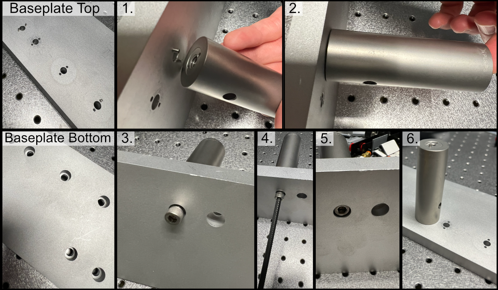
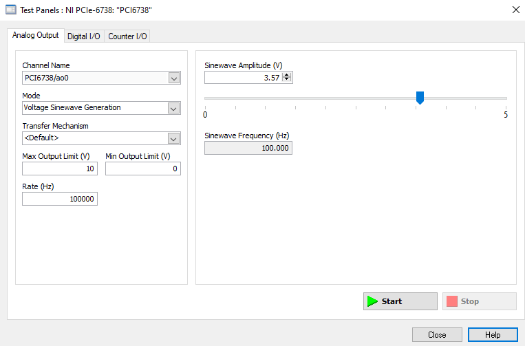

.. _assembly-home:

###################
Microscope Assembly
###################

---------------

Parts List and Cost
___________________

A breakdown of all components used in COMPASS, and the approximate cost are included in the collapsable sections below:

.. collapse:: Illumination Path

    .. list-table::
       :header-rows: 1

       * - Standard Parts
         - Vendor
         - Purpose
       * - TL20X-MPL
         - Thorlabs
         - Illumination Objective
       * - Polaris-1XY
         - Thorlabs
         - Mounting
       * - Polaris-K1XY
         - Thorlabs
         - Mounting
       * - Polaris-MA45
         - Thorlabs
         - Mirror Mounting
       * - Polaris-P150
         - Thorlabs
         - Mounting
       * - Polaris-P200
         - Thorlabs
         - Mounting for L4
       * - Polaris-P3
         - Thorlabs
         - Mounting
       * - Polaris-P250
         - Thorlabs
         - Mounting
       * - Polaris-P225
         - Thorlabs
         - Mounting
       * - Polaris-P075
         - Thorlabs
         - Mounting
       * - Polaris-P175
         - Thorlabs
         - Mounting
       * - Polaris-B1S
         - Thorlabs
         - Lens Mounting
       * - Polaris-K1S4
         - Thorlabs
         - Mirror Mounting
       * - CFC11A-A
         - Thorlabs
         - Fiber Laser Collimator
       * - P3-405B-FC-1
         - Thorlabs
         - Single Mode Fiber
       * - AC254-080-A-ML
         - Thorlabs
         - L2
       * - AC254-030-A-ML
         - Thorlabs
         - L1
       * - VA100CP
         - Thorlabs
         - Rectangular Aperture
       * - ACY254-075-A
         - Thorlabs
         - L3
       * - PF10-03-P01
         - Thorlabs
         - 1\" Mirror
       * - RSP1
         - Thorlabs
         - Rotation Mount For Cylindrical Lens
       * - AC254-250-A-ML
         - Thorlabs
         - L4
       * - SM1A12
         - Thorlabs
         - Illumination Objective Mounting
       * - 1-Axis 4kHz Resonant Galvo and Servo
         - Novanta
         - Galvo Mirror
       * - TGPOW-12-3
         - ASI
         - Galvo Low Noise Power Supply +12V 3A
       * - Polaris B1F
         - Thorlabs
         - Mount for Mirror 2
       * - ID12
         - Thorlabs
         - Mounted Circular Iris (12 mm Max Aperture)
       * - L4CC
         - Oxxius
         - Multicolor Laser Source
       * -
         -
         -
       * - **Custom Machined Parts**
         - **Vendor**
         - **Purpose**
       * - RSP1 Polaris Adapter
         - Xometry
         - Polaris Adapter for RSP1 Cylindrical Lens
       * - Illumination Baseplate
         - Xometry
         - Baseplate
       * - Galvo Holder
         - Protolabs
         - Galvo Mounting
       * - VA100CP Polaris Adapter
         - Xometry
         - Aperture Mounting
       * - IDA12 Polaris Adapter
         - Xometry
         - Polaris Adapter for ID12 Iris

.. collapse:: Detection Path

    .. list-table::
       :header-rows: 1

       * - **Part**
         - **Vendor**
         - **Purpose**
       * - N25X-APO-MP
         - Thorlabs (Nikon)
         - Detection Objective
       * - LS-100-AMCCH
         - ASI
         - 100 mm Linear Focusing Stage
       * - TGDCM2
         - ASI
         - 2-Axis Stage Control Card
       * - C60-EXT-15
         - ASI
         - 15 mm Tube Extension
       * - RAO-0051
         - ASI
         - M32x0.75 Threaded Sleeve
       * - FW-0002-8
         - ASI
         - 8-Position Filter Wheel
       * - FW-C-MNT-K1
         - ASI
         - Filter Wheel to MIM Adapter Kit
       * - TGFW
         - ASI
         - Filter Wheel Control Card
       * - C60-TUBE-400
         - ASI
         - 400 mm Achromatic Tube Lens
       * - C13440-20CU
         - Hamamatsu
         - ORCA Flash4.0 V3 Camera
       * - Semrock Brightline Filter 605/15-25nm
         - IDEX
         - Filter
       * - Semrock Brightline Filter 445/20nm
         - IDEX
         - Filter
       * - Semrock Brightline Filter 676/29 nm
         - IDEX
         - Filter
       * - Semrock Brightline Filter 529/24-25nm
         - IDEX
         - Filter

.. collapse:: Sample Positioning

    .. list-table::
       :header-rows: 1

       * - **Part**
         - **Vendor**
         - **Purpose**
       * - KBT1X1T
         - Thorlabs
         - Magnetic Mount for Sample Holder Top
       * - KBB1X1
         - Thorlabs
         - Magnetic Mount for Sample Holder Bottom
       * - LS-5012
         - ASI
         - Breadboard Adapter for Translation Stages
       * - LS-5013
         - ASI
         - Right Angle Bracket for Translation Stages
       * - DV-6010-C
         - ASI
         - Dovetail Mount Pair
       * - LS-50-AMCLLS
         - ASI
         - 50 mm Linear Stage with Stainless Steel Slide
       * - LS-100-AMERL
         - ASI
         - 100 mm Linear Stage, 16 TPI, Extended, Right
       * - LS-50-AMELL
         - ASI
         - 50 mm Linear Stage
       * - TGADEPT
         - ASI
         - Piezo Control Card
       * - HS1.100
         - PiezoConcept
         - 100 Micron Piezo Stage
       * - ADAPTHS1BB
         - PiezoConcept
         - Adapter Plate for PiezoConcept HS1
       * -
         -
         -
       * - **Custom Machined Parts**
         - **Vendor**
         - **Purpose**
       * - Angle Bracket Adapter
         - Xometry
         - Mounting the piezo to ASI translation stages at an angle
       * - 5mm Coverslip Holder
         - Xometry
         - Sample holder for 5 mm Coverslips
       * - 5mm Coverslip Holder Adapter
         - Xomtery
         - Adapter to mount coverslip holder onto KBT1X1T linearly

.. collapse:: Shared Equipment

    .. list-table::
       :header-rows: 1

       * - **Part**
         - **Vendor**
         - **Purpose**
       * - TG16-BASIC
         - ASI
         - Tiger Controller - 16 Bay System
       * - T3283
         - Thorlabs
         - BNC Adapter (F-F)
       * - PAA272R
         - Thorlabs
         - SMB F to BNC M cable adapter
       * - CA2106
         - Thorlabs
         - BNC to Terminal Pin Cable
       * - PCIe-6738
         - NI
         - Data Acquisition Card
       * - SHC68-68-A2
         - NI
         - Test Cable Assembly
       * - SCB-68A
         - NI
         - Noise Rejecting Terminal Block
       * - SX6300
         - Colfax International
         - Colfax SC6300 Workstation
       * - 14UD-42X-24
         - TMC
         - Ultradamp Vibration Isolation with Casters
       * - 784-736-02R
         - TMC
         - 36x60x18\" Performance Series Optical Top Table

.. collapse:: Total Cost

    .. list-table::
       :header-rows: 1

       * - **Section**
         - **Cost (USD)**
       * - Illumination Path
         - \$42,419.67
       * - Detection Path
         - \$61,635.82
       * - Sample Positioning
         - \$18,869.78
       * - Shared Equipment
         - \$32,300
       * - **TOTAL**
         - **\$155,224.78**

---------------

Illumination Path
_________________

Our baseplate design was made with ease of assembly in mind. The basic process involves aligning Polaris posts with
dowel pins and screwing them using 1/4"-20 Screws in at the predetermined hole locations on the breadboard.
This general process is depicted below:

    **Figure 1:** General process for baseplate assembly

To either mount the baseplate onto an optical table or onto separate posts, the process is similar in that
just requires screwing 1/4"-20 screws into either an optical breadboard or onto separate posts at the four corner
holes. For our system, we opted to mount our illumination baseplate on 1.5" tall `1" diameter Thorlabs pedestal posts
<https://www.thorlabs.com/newgrouppage9.cfm?objectgroup_id=851>`_. As a general note, having the illumination path
elevated instead of affixed directly into the table is both helpful to enable access to mounting and unmounting the
illumination optics as well as ensuring that the illumination objective and detection objective are able to be
aligned vertically with each other.

.. figure:: Images/BaseplateAssembly_Corners.png
    :align: center
    :alt: General process to place posts on baseplate corners

    **Figure 2:** General process to place posts on baseplate corners

---------------

Mounting Lenses
^^^^^^^^^^^^^^^

Mounting lenses into a Polaris lens mount and onto an associated post is a fairly straightforward process. The
general flow is shown in the image below, where first the flatter face of the desired lens should be placed such that
it is touching the metal boundary on the lens mount itself. Then the lens should be fixed into place by screwing the
lock screw on the top of the lens mount. With the lens secured in the mount, then two dowel pins should be placed in
the appropriate holes on the Polaris post, and then the lens mount should be placed such that the two holes on the
lens mount align with the pins on the Polaris post. Then the lens mount should be anchored into place by screwing it
into the Polaris post. Additional information can be found at `Thorlabs <https://www.thorlabs.com/newgrouppage9.cfm?objectgroup_id=10056>`_.

.. figure:: Images/LensMounting.png
    :align: center
    :alt: General process for mounting a lens into a Polaris holder and onto a post

    **Figure 3:** General process for mounting a lens into a Polaris holder and onto a post

---------------

Initial Laser Collimation and Alignment
^^^^^^^^^^^^^^^^^^^^^^^^^^^^^^^^^^^^^^^

When first assembling the system, ensuring proper output collimation from the fiber laser source is critical. There are multiple checks that one can take for this step, but we utilize a combination of a `shear-plate interferometer <https://www.thorlabs.com/newgrouppage9.cfm?objectgroup_id=2970>`_ and two pinhole apertures placed at opposite ends along the length of the baseplate. Shear-plate interferometers are designed to split and interfere an input beam of coherent light, such that when the beam is collimated there are interference fringes aligned vertically with a reference line. The fiber laser collimator we used for this system is the `Thorlabs CFC11A-A <https://www.thorlabs.com/thorproduct.cfm?partnumber=CFC11A-A>`_, which features an adjustable barrel which controls the position of collimation optics within the element.

The basic assembly process involves first inserting and fixing the CFC11A-A into a Thorlabs AD15S2 adapter, which allows it to then be mounted into a 2.5" Polaris K1XY mount. This assembly is then mounted onto the respective Polaris post at the start of the baseplate. The fiber laser source is then able to be directly mounted into the CFC11A-A, making sure that the protrusion on the fiber wire aligns with the open section of the CFC11A-A port. The basic process of ensuring collimation then involves turning on the laser source, and placing the shear-plate interferometer such that the input port aligns with the output of the laser unit. Then, by slowly adjusting the barrel of the CFC11A-A and observing the interference fringe orientations along the top display of the interferometer, one is able to adjust the beam until it is properly collimated.

.. figure:: Images/LaserAlignment1.png
    :align: center
    :alt: Shear Plate interferometer and collimator lens
    :width: 60%

    **Figure 4:** Shear Plate interferometer and collimator lens

With the beam collimated, the process of beam alignment involves adjusting the position control knobs on the K1XY to have the beam pass through two pinhole apertures along the optical path. The height of the initial laser output is designed to be at 3.75" above the top surface of the baseplate, so selecting appropriate post heights for the apertures such that their centers rest at 3.75" is essential. In our case, we use `Thorlabs ID12 <https://www.thorlabs.com/thorproduct.cfm?partnumber=ID12>`_ pinhole apertures, so using a post height of 3.25" will ensure that they are at the proper height for alignment. We designed a `custom ID12 to Polaris adapter <https://github
.com/TheDeanLab/COMPASS/tree/main/downloads/common/cad>`_ to ensure the aperture is at the proper height and properly aligned along the designated Polaris axis. When using this method, the ID12 to Polaris Adapters can just be directly mounted onto the holes designated for L1 and the Illumination Objective, depicted below, to cover the length of the baseplate. With the pinholes placed, the process becomes iterative by making small adjustments on the K1XY tip/tilt knobs and XY position screws until the beam passes through both pinholes.

    **Figure 5:** Performing beam alignment across the baseplate

---------------

Mounting of Optic Posts
^^^^^^^^^^^^^^^^^^^^^^^

After ensuring basic collimation and alignment of the laser system, the next step is mounting the appropriate polaris
post size for each optical element in the system. The overall breakdown of which size posts went with each hole
location is listed below. Where holes (3), (4), and (10) are placements for optional elements in the system. (3) is
meant for the placement of an adjustable pinhole aperture, where the same ID12 to Polaris Adapter system used in
the alignment step can be placed. Otherwise a 0.5" post holder can be placed here, and then the ID12 or ones pinhole
aperture of choice can be mounted on a 0.5" post. (4) is dedicated placement for an electronic shutter in the event
that the laser being used for the system isn't directly controlled via a computer, and helps to ensure that laser
light is not photobleaching a sample unless imaging is taking place. (10) is dedicated space for a neutral density
(ND) filter, in the event that the power of the laser used needs additional reduction not directly addressable
through the laser controls itself.

.. figure:: Images/PostHeightBreakdown_Updated.png
    :align: center
    :alt: Schematic of which holes use which post heights

    **Figure 6:** Schematic of which holes use which post heights

---------------

Mounting of Optics
^^^^^^^^^^^^^^^^^^

With the posts in place, the next step involves mounting the optics elements themselves onto the posts. When mounting elements (6), the VA100 rectangular aperture, and (7), the RSP1 rotation mount, it should be noted that the corresponding element should first be fixed onto their respective Polaris adapter and then onto the Polaris posts. In addition, take measures to mount the 45 degree mirror (9) fully prior to mounting the resonant galvo to ensure that the galvo is not accidentally hit during installation of the 45 degree mirror.

To construct the 45 degree mirror assembly, first mount the Polaris K1S4 onto the Polaris-MA45 45 degree mounting adapter, and then place a 1" diameter mirror into the K1S4 and secure it using the K1S4 mounting screw.

To construct the illumination objective assembly, first mount the Polaris 1XY onto its respective 1.5" post. The threading of the 1XY (SM1) does not match that of our illumination objective used (M25x0.75), so an SM1A12 adapter must first be installed onto either the 1XY or the illumination objective. Then, the objective can be mounted onto
the 1XY.

---------------

Final Alignment Adjustments
^^^^^^^^^^^^^^^^^^^^^^^^^^^

Once all the optics have been properly mounted, the final step for ensuring a working illumination path is to center
the beam after the 45 degree mirror onto the center of back lens surface of the illumination objective. The primary
method of doing this is through adjusting the xy tip/tilt knobs on the K1S4 Polaris mount that houses the 45 degree
mirror.

---------------

Detection Path
______________

Detection Path Assembly
^^^^^^^^^^^^^^^^^^^^^^^

Our detection path consists of our Nikon N25X-APO-MP detection objective, Hamamatsu ORCA Flash4.0 V3 Camera, ASI
C60-TUBE-400 tube lens, and ASI FW-0002-8 8-position filter wheel unit. These components are mounted together and
affixed onto an ASI LS-100-AMCCH translation stage for focus control. We currently use a prototype detection path
baseplate (available here) as a mounting stage for these elements and the sample chamber; however, this additional
baseplate is still undergoing design iterations and is not critical for a functional detection path.

We utilize two additional custom adapter elements in the construction of the detection path: a shell casing around
the tube lens that mounts to the translation stage and an adapter for the translation stage to mount it to an optical
breadboard table. The height thicknesses of these elements were chosen such that the height of the detection
objective center should match that of the illumination objective (which with the 1.5" tall posts our illumination
baseplate rests on is 4.75" above the optical table surface). These elements can be custom machined if desired;
however, we have found 3D printed PLA variants to perform their functions effectively as well.

The assembly of the detection path begins with the translation stage and it's associated breadboard adapter
(available here in two variants, based on whether or not one is using the 0.5" thick detection path baseplate):

    1. Turn the translation stage upside-down
    2. Place the breadboard adapter upside-down on top of the inverted translation stage (such that the raised
       platform of the adapter is touching the bottom side of the translation stage)
    3. Align the recesses on the bottom of the adapter with the holes on the bottom of the translation stage
    4. Fix the adapter onto the translation stage by screwing M6 screws into the recesses aligned with the
       translation stage holes.

    **Figure 7:** Schematic of the translation stage breadboard adapter

The next step is flipping the translation stage assembly right side up again, and then fixing the first of two halves
of the tube lens adapter onto the top of the translation stage:

    1. Place the tube lens adapter half onto the top of the translation stage such that the block with two sets of
       five recessed holes is touching the top of the translation stage.
    2. Align the Recess holes on the adapter with the holes on the top of the translation stage.
    3. Fix the adapter onto the translation stage by screwing M6 screws into the aligned recess holes

    **Figure 8:** Schematic of the tube lens to translation stage adapter

Next, we'll focus on assembling the tube lens and filter wheel:

    1. Take the MIM to Filter wheel adapter and fix it onto the front port of the filter wheel using the associated
       screw ports
    2. With the adapter fixed, now screw the 400 mm tube lens into the adapter.

    **Figure 9:** Schematic of the filter wheel port for the tube lens

In order to fix our detection objective onto the tube lens, we must first prepare an extension and threading adapter:
    1. Take the C60-EXT-15 15 mm Tube extension piece and place the RAO-0051 M32x0.75 threaded sleeve inside
    2. Using the screws on the top of the extension piece, fix the threaded sleeve in place
    3. Insert/screw the extension piece into the front of the tube lens.

    **Figure 10:** Showcase of the screws used to secure the thread adapter for the tube lens

The tube lens assembly is now ready to be fixed onto the translation stage assembly:
    1. Place the tube lens assembly such that the tube lens lies within the curved region of the tube lens adapter
    2. While there isn't an exact science to the relative placement of the tube within the adapter, try to position
       it such that more of the tube is extended out on the side where the objective will be mounted (our setup is shown
       below for reference).
    3. Place the second half of the tube lens adapter such that the curved side fits onto the lube lens and position
       it such that the holes of both halves of the adapter align with each other.
    4. Using your choice of either M6 or 1/4"-20 screws and associated washers/nuts, place the screws with a washer
       placed on them first into the aligned holes of the adapter. We used 4 of the adapter holes on each side, but
       more can be used for extra security if desired.
    5. Screw a washer onto each of the screws until they're secured against the bottom lip of the adapter.

    **Figure 11:** Example of tube lens mounted in the corresponding adapter

The detection path assembly can now be fixed into place onto either the detection path baseplate or the optical
table, keep in mind this process is meant to essentially place the unit in the ballpark of where it should be, finer
adjustments will be made afterwards:

    1. Using the mounting holes on the translation stage assembly, place the assembly such that the edge of the
       translation stage adapter facing the illumination path is roughly 9-10" away from the location of the
       illumination objective.
    2. Using the adjacent edge of the translation stage adapter (the one that should be perpendicular to the
       orientation of the illumination path), try to align the side of the adapter with the mounting hole of the
       illumination objective.
    3. Screw the translation stage adapter into either the optical table to the detection path baseplate (we
       recommend using `Thorlabs 1" Spacers <https://www.thorlabs.com/newgrouppage9.cfm?objectgroup_id=851>`_ in place
       of washers here).

          baseplate
    :width: 300px

    **Figure 12:** Setup for securing the translation stage to breadboard adapter onto our detection path baseplate

With the assembly fixed in place, the camera can then be screwed into the filter wheel:
    1. Align the front thread of the camera with the back port of the filter wheel
    2. Screw the camera into the filter wheel until there is resistance
    3. Slowly adjust the camera tilt until the top surface is leveled (we use a bubble leveling tool for this, shown
       below)

.. figure:: Images/Camerarotation.png
    :align: center
    :alt: Mounting of the camera

    **Figure 13:** Mounting of the camera

The final steps to to assemble the detection path are to screw the detection objective into the front of the tube
lens and attach all associated wires to the camera, filter wheel, and translation stage. If there's not enough
clearance between the front of the tube lens and the sample chamber to screw in the detection objective, the
translation stage might need to be wired up first and translated backwards manually using either navigate or the
Tiger Control Panel software.

---------------

Detection Path Positioning
^^^^^^^^^^^^^^^^^^^^^^^^^^

To position the detection path correctly, there's two primary steps: Initially ensuring the detection objective slides into the correct port on the fixed sample chamber and then ensuring that the light sheet is centered in the FoV of the camera, typically done by putting  fluorescein into the water-filled chamber.

**Step 1: Ensuring the detection objective slides into the sample chamber port**
    1. It's recommended to start with your detection path translation stage set far enough back such that there is anywhere from 0.5-1" or more of space between the front of the detection objective and the sample chamber.
    2. Within navigate or the Tiger Controller software, start to slowly move the objective forward (initially increments of 1000 um should be okay, but as the objective approaches the port the distance should be significantly lowered to 100 um or below to ensure the objective isn't damaged).
    3. If the objective isn't centered properly, the screws/nuts on the translation stage to breadboard adapter (see figure 12) can be loosened slightly and the detection path assembly can be carefully positioned horizontally, taking care that the unit isn't tilted at an angle going into the objective port, and then re-tightened.

Once the detection objective properly translates into it's port, the tilt alignment can be further refined by slowly translating the detection objective forward towards the illumination objective, taking great care that they don't touch each other. If there is a significant tilt in the detection path compared to the illumination path, it should be fairly evident in the diagonal space between the objectives (ideally it should look roughly equal in width between the two objectives). As example of the relative position of our objectives when the detection objective is properly placed at the focus of the illumination objective is shown below to give a visual reference for users.

Once the position of the detection objective is acceptable, further refinement of it's position can be done by first filling the chamber with water and then adding roughly ~100 microliters of f fluorescein into the chamber. Fluorescein  is useful as a visualization tool to be able to see the beam coming out of the illumination objective with the naked eye. With fluorescein in the chamber, the position of the detection objective can be translated to align with the focus of the beam itself (shown below)

    **Figure 14:** Physical alignment of the detection objective

**Step 2: Focus refinement**
    With the detection objective roughly in the correct location, further refinement is done by turning on the camera and imaging the fluorescein light-sheet to find the focus by adjusting the focus translation stage in small increments (50 microns for large movements, 1-5 microns for small movements). The goals during this step are to ensure that the detection objective focus is at the focus of the illumination objective, to make sure the light-sheet focus is centered on the image FoV from the camera, and that the light-sheet is aligned vertically in the image FoV.

    Finding the focus is often something that just comes with experience of using the system itself; however, here are some general methods to follow that can help get one's bearings:
        1. In general, as the detection objective approaches the light sheet focus, an envelope of light should start to appear (see below), ideally this envelope will be horizontal across the FoV. If it horizontal or has some tilt to it, adjusting the tip/tilt of the 45 degree mirror and the rotation of the cylindrical lens. In addition, ideally this envelope will be centered vertically in the FoV, which can be set by adjusting the y adjustment screw on the illumination objective mount.
        2. Towards the focus location, a dark vertical region with horizontal striations should appear. Once this region is visible, using small translation distances (~1 um or finer) to find the position that makes both the vertical region and horizontal striations look as sharp as possible should be done.
        3. If the dark region isn't centered on the image FoV, adjusting the x and y adjustment screws on the illumination objective mount and making slight horizontal translations on the detection path can help.
        4. In general doing these adjustments in small increments is helpful, as once adjustments to the various elements may require readjusting the focus translation stage position to keep track of the focus.

.. figure:: Images/FocusFinding.png
    :align: center
    :alt: Breakdown of the light sheet focus within navigate
    :width: 400px

    **Figure 15:** Breakdown of the light sheet focus within navigate

---------------

Optomechanics
_____________

Visualization of Axes Mapping
^^^^^^^^^^^^^^^^^^^^^^^^^^^^^

In our system we have 5 different translation stages at work: the standard x,y, and z axes, an additional stage along the z axis to control the focus of the detection path (f), and and axis associated with the piezo positioned such that its normal is 60.5 degrees away from the y-axis.

.. figure:: Images/PhysicalAxesMaps.png
    :align: center
    :alt: Layout of how the axis of the system are mapped
    :width: 220px

    **Figure 16:** Layout of how the axis of the system are mapped

.. note:: **Coordinate System Differences**

   The coordinate axes used in **optical simulations** differ from those in the **physical microscope system**
   controlled by **navigate**. This discrepancy arises from **standardized axis conventions** in Zemax versus
   those historically used in our previous systems. Users should be mindful of this distinction when interpreting
   simulation results versus real-world microscope operation. The differences are illustrated below:

   .. image:: Images/CoordinateSchemeChange.png
      :align: center
      :alt: Difference in coordinate axes for simulation and physical setup

---------------

The Piezo Angle Mount
^^^^^^^^^^^^^^^^^^^^^

We designed a custom angled mount for our `Piezoconcept HS1 piezo <https://piezoconcept-store.squarespace
.com/1-axis/p/hs1>`_ in order to be able to scan our sample easily between our two objectives by translating a single motorized unit (in this case the piezo), instead of having to calculate and program the movement of two translation stages in tandem for both the y and z directions. The anatomy of our angled mount is broken down in the figure below, where there are four translation stage mounting holes to attach the unit to an ASI translation stage, nine Piezo mounting holes that correspond to the mounting scheme of our piezo unit, as well as four through-holes and a window for ease of access for the mounting process. We provide the CAD files for this mount `here <https://github
.com/TheDeanLab/COMPASS/tree/main/downloads/common/cad>`_, and have had success in using both 3D printed and aluminum machined versions of the unit. It's recommended to first mount the angle mount onto the translation stage unit before mounting the piezo on the angle mount to ensure access to all the through-holes.

.. figure:: Images/AnglemountAnatomy.png
    :align: center
    :alt: Breakdown of our custom angle piezo angle mount

    **Figure 17:** Breakdown of our custom angle piezo angle mount.

The installation of our custom angled piezo mount is designed to be directly compatible with ASI translation stages. ASI translation stages feature M6 hole pairs that are spaced along the length of the translation stage at intervals dependent on the specific stage one is using. The mounting process involves aligning these 4 holes with 4 of the M6 holes on the translation stage and screwing them in. For ease of screwing in the base, there are four through holes on the angled face of the mount shown in B that a screwdriver is able to pass directly through to screw as shown in C. An alternative method of mounting is shown in D, where the window on the back of the angle mount is able to be screwed through as well.

.. figure:: Images/Anglemount.png
    :align: center
    :alt: General process for mounting our piezo angle mount onto an ASI translation stage

    **Figure 18:** General process for mounting our piezo angle mount onto an ASI translation stage

---------------

Sample Holder Design
^^^^^^^^^^^^^^^^^^^^

Our sample holder design is built for imaging cells on a `5 mm coverslip <https://www.fishersci.com/shop/products/5mm-cover-slip-german-glass/50949439>`_, and is shown below. The design features a clamp-like method of securing the 5 mm coverslip in place, where the coverslip rests in an inset region and the clamp is screwed in via an M1.6 screw in the back of the holder. All associated files for this design and other custom parts can be found `here <https://github.com/TheDeanLab/COMPASS/tree/main/downloads/common/cad>`_.

.. figure:: Images/S_SampleHolderAssembly.png
    :align: center
    :alt: 5 mm coverslip sample holder design

    **Figure 19:** 5 mm coverslip sample holder design.

---------------

Assembling the Magnetic Sample Mount
^^^^^^^^^^^^^^^^^^^^^^^^^^^^^^^^^^^^

As a safeguard for the risk of the sample crashing into either the illumination or detection objective during sample positioning or imaging, we opted to incorporate a magnetic mount for our sample holder. We use a Thorlabs KBT1X1T and KBB1X1 as our magnetic mount pair, and then mount our sample holder onto the KBT1X1T using a  `custom adapter <https://github.com/TheDeanLab/COMPASS/tree/main/downloads/common/cad>`_. The KBB1X1 is affixed to the piezo using an M2.5 screw, and using a small leveling tool (shown below) during this step is helpful to ensure that the magnetic base is mounted as level as possible for the imaging process.

.. figure:: Images/MagneticMountSampleHolder.png
    :align: center
    :alt: Basic assembly of magnetic sample holder mount

    **Figure 20:** Basic assembly of magnetic sample holder mount

---------------

Optoelectronics
_______________

Wiring Diagram
^^^^^^^^^^^^^^

Our complete microscope assembly features a variety of different optoelectrical and optomechanical elements. These
elements are primary controlled via our NI DAQ (PXIe-6738) or our ASI Tiger Controller (TG16-BASIC), which are then
controlled via navigate during the imaging process. The diagram below depicts how these elements are wired together,
as well as an individual pinout designation table for the pin configurations we used on our DAQ.

.. figure:: Images/Wiring3_Plustable.png
    :align: center
    :alt: Wiring diagram for the Tiger Controller, DAQ, and associated elements.

    **Figure 21:** Wiring diagram for the Tiger Controller, DAQ, and associated elements.

---------------

Piezo Setup & Troubleshooting
^^^^^^^^^^^^^^^^^^^^^^^^^^^^^

On the PCI Board, connect the positive and negative wires  to the corresponding analog output (AO) you want, in our case
we used AO 0, so we connected the positive wire to pin 10 and the ground to pin 11, then plug the BNC cable connected to
those wires into the EXT IN input on the Tiger controller panel corresponding to the piezo.

    **Figure 22:** How to find the Device Pinout panel in NI MAXX.

Plug the piezo cable into the PIEZO input on the Tiger controller panel corresponding to the piezo, and verify the range of the piezo in the Tiger Controller software:

.. code-block:: none
   :caption: Verifying Piezo Range in Tiger Controller Software

   # Verify the range of the piezo in the Tiger controller software
   5 cca x?

   # Example output:
   :A  Q:P1
   23 P 1 100um RANGE
   24 P 2 200um RANGE
   35 P S 150um RANGE
   36 P 3 300um RANGE
   37 P 5 500um RANGE
   34 P f 50um RANGE
   25 P 4 350um RANGE:N-4

This tells us that our Piezo (Panel 5/Q) corresponded to P1 or a 100 um range, but ASI requires the piezo needed to be
set to  a 50 um range to be able to be initialized instead. To change this, we used the command ``5 cca x = 34`` and
power cycled the controller. Once the controller was powered back on, we verified the range again with the ``5 cca x?``

.. code-block:: none
   :caption: Verifying Piezo Range in Tiger Controller Software

   # Verify the range of the piezo in the Tiger controller software
   5 cca x?

   # Example output:
   :A  Q:Pf
   ...

Now we can see that the piezo is set to the correct range (Pf). With that verified, now confirm that the voltage output from the PCI Board is working:

| 1. Put the BNC cable input currently in EXT IN on the Tiger control panel into the input of the oscilloscope instead.
| 2. Go to the test panels for the PCI board in NI MAX.

.. figure:: Images/TestPanels.png
    :align: center
    :alt: How to find the Test Panels panel

    **Figure 23:** How to find the Test Panels panel in NI MAXX.

| 3. Set the voltage mode to sinewave generation.
| 4. Set the voltage range to be between 0 to 10 V.
| 5. Set the frequency to a desired value (we ended up setting it pretty high at 10000 Hz for ease of viewing on the oscilloscope).

    **Figure 24:** How to generate analog output voltages with NI MAXX for testing purposes.

With the voltage output of the PCI board verified, plug the PCI Board voltage cable output back into the EXT IN slot and
verify that the position output of the Piezo reads similarly on the oscilloscope:

    1. Plug a BNC Cable into the SENSOR OUT connection on the tiger controller panel.
    2. Plug the other end of that cable into the oscilloscope.
    3. Verify that a sinewave output is seen on the oscilloscope.

If the PCI Board voltage is working as intended but the piezo position output doesn't seem to work, try ensuring that
the piezo is set in `External Input mode, and not Controller Input mode <https://asiimaging.com/docs/commands/pm>`_:

    1. Use the ``PM Q?`` (Our piezo corresponds to Q) command:
        - the output was ``Q = 0`` originally, telling us that it's in Controller Input mode
    2. Use the ``PM Q = 1`` command to set the piezo into External Input mode:
        - now the output of ``PM Q?`` is ``Q = 1``

Another important step is to ensure that the configuration file associated with navigate is appropriately set up for your piezo. This involves setting the correct axis and voltage-to-distance mapping for the piezo. As an example our configuration file for navigate looks like the following for setting up our piezo:

.. figure:: Images/Piezo_Config.png
    :align: center
    :alt: Navigate configuration file for the piezo.

    **Figure 25:** Navigate configuration file for the piezo.
