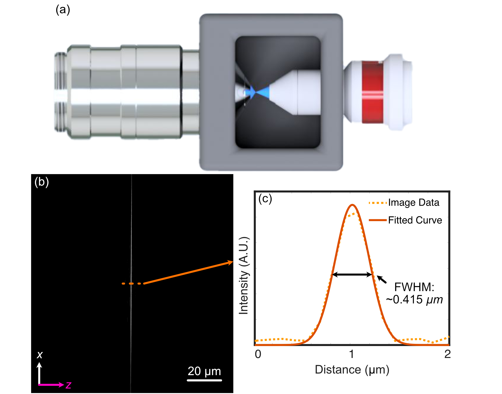
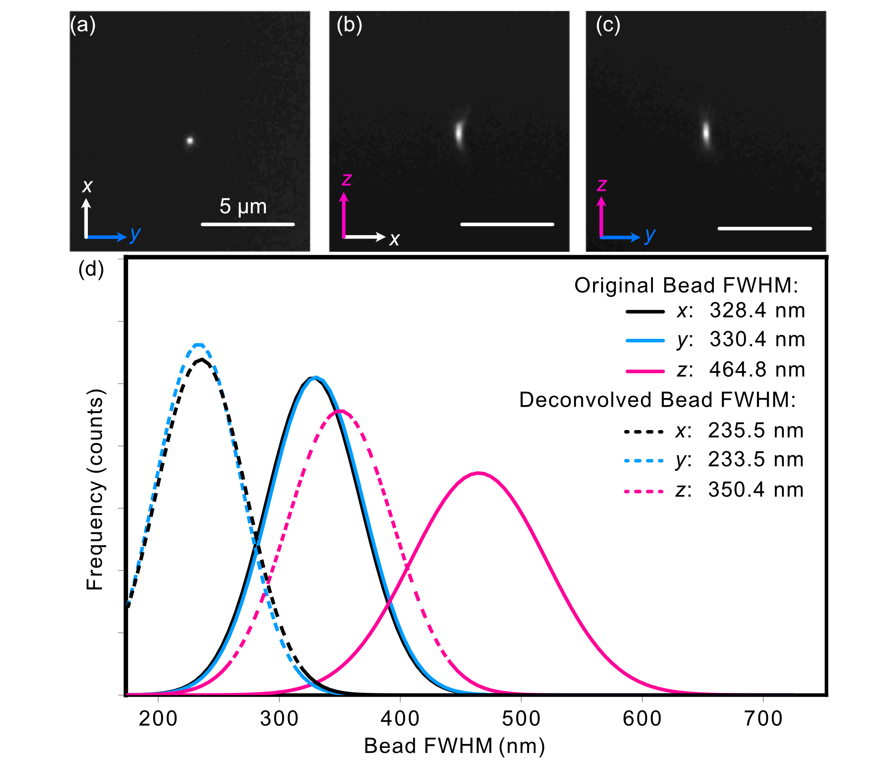
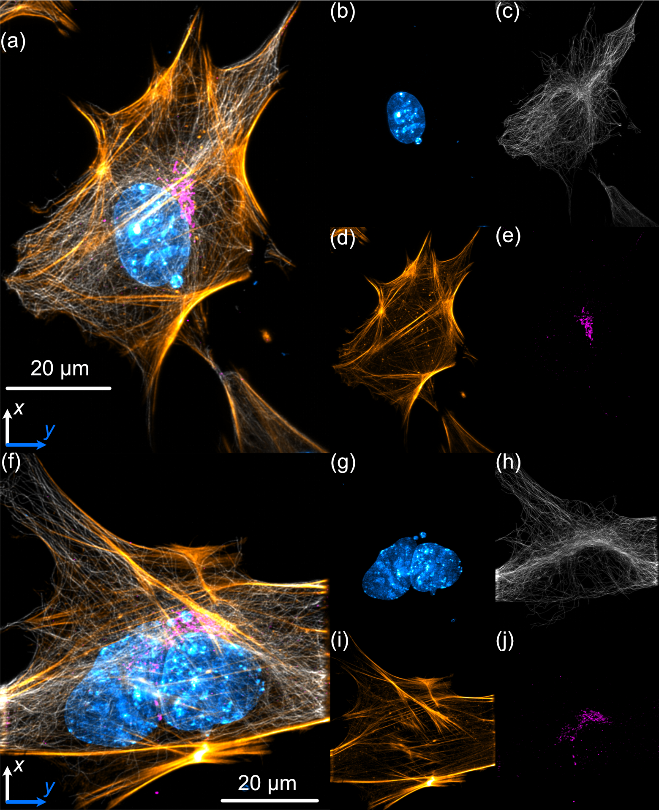

.. _process-home:

###############################
System Characterization
###############################

Beam Characterization and PSF Analysis
______________________________

To characterize our constructed system, we first image the generated light-sheet using the sample chamber transmission configuration shown below, where the illumination objective is placed directly in front of the detection objective. The image of our light sheet is shown in (a) below, where the cross-sectional profile of the light-sheet is shown in (b) and reveals a z-FWHM of ~0.415 um.

To characterize the resolution of our system, we utilize 100 nm YG Fluorsecent Beads (ID: 17150-10) from Polysciences Inc. The beads are first affixed onto a 5 mm coverslip using the following protocol:

    1. Assemble petri dish, coverslip, and 5mM concentration (3-Aminopropyl)triethoxysilane (APTS)
    2. Put 5 mm coverslip in petri dish
    3. Apply ~100 microliters of (3-Aminopropyl)triethoxysilane (APTS) on top of coverslip
    4. Allow APTS to incubate for ~10-30 minutes
    5. Wash coverslip lightly with DI water 3 times
    6. Put beads of desired dilution (typically 10^-3 or 10^-4 for a normal distribution, 10^-6 for a sparse
       distribution) onto coverslip and allow to incubate between 2-20 minutes. Longer incubation time allows for more
       beads to adhere to the coverslip
    7. Wash lightly afterwards with DI water

After affixation, the beads are then imaged, the results of which are shown below. The PSF of an isolated bead is shown below in (a-c), where each image is a different orthogonal perspective of the bead's intensity distribution, and provide us insight into the resolution of our system in each orthogonal direction. We then provide Gaussian-fitted distributions of the FWHM of the population of fluorescent beads across a given z-stack in (d), both before and after applying deconvolution procedures. Prior to deconvolution, the average FWHM values across the bead population were 328 in x, 330 nm in y, and 464 nm in z. After deconvolution with PetaKit5D, these values improved to 235.5 nm in x, 233.5 nm in your, and 350.4 in z.

Sample Biological Images
______________________________

As a demonstration of COMPASS' biological imaging capabilities, we prepared and imaged mouse embryonic fibroflast
(MEF) cells, where multiple subcellular structures were stained for 4 different channels corresponding to the
excitation wavelengths of our laser source (405 nm, 488 nm, 561 nm, 638 nm). The staining protocol described in [cite
Compass paper] was optimized for visualization of the nucleus (DAPI, 405 nm, cyan channel), microtubules (488 nm,
gray channel), actin filements (561 nm, gold channel), and the Golgi apparatus of the MEF cells (638 nm, magenta).

A deconvolved maximum intensity projection of a distribution of MEF cells is shown below in (a) and (f), with a
 each individual channel displayed in (b-e) and (g-j). These results display
fine nucleolar features within the nucleus, well-defined perinuclear Golgi stuctures, well-resolved stress fibers in the actin channel, and individually distinct microtubules, demonstrating COMPASS' ability to capture high-resolution images of cytoskeletal structures. Additionally, the yz projection of the image stack in shown in (c).

